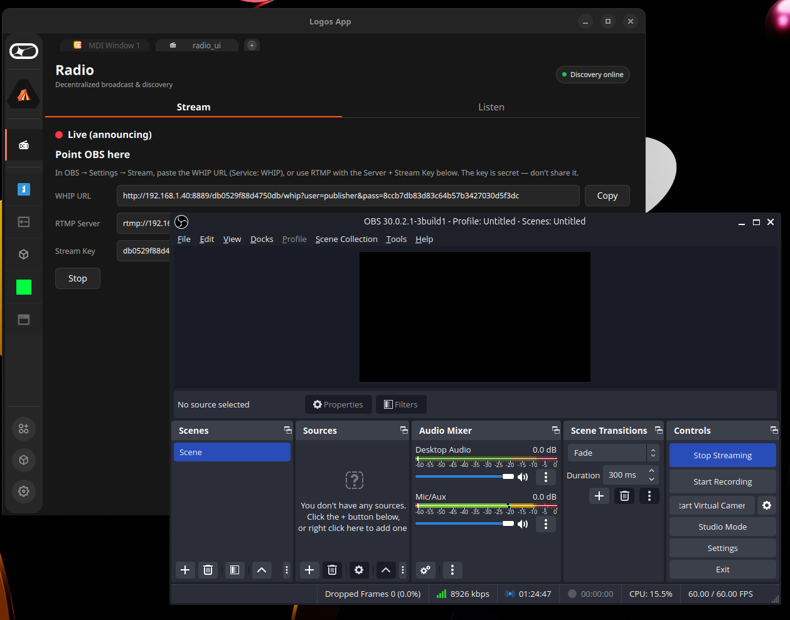

# radio-basecamp

Decentralized **audio broadcast** module for [Logos Basecamp](https://github.com/logos-co/logos-app).
A host broadcasts a stream; listeners **discover it over LogosMessaging by topic** — no central
index, no account — and play it. The differentiator is **discovery, not delivery**.

> Status (2026-06-10): **P0 vertical slice complete and demoed cross-machine** — a host broadcasts
> and a *separate machine* discovers it over LogosMessaging and plays it, with no central index.
> ⚠️ Runs on Basecamp **`pre-release-1dc1c08-268`** — newer builds crash any `delivery_module`
> consumer (see [Compatibility](#compatibility)). v1 is **audio-first**. Implementation tracked in
> [`docs/plans/radio-implementation.md`](docs/plans/radio-implementation.md).

---

## Demo

Two machines, no server between them — the host streams from OBS while a *separate* listener
discovers the station over LogosMessaging (Waku) and plays it:

| Host — broadcasting (OBS → MediaMTX → announce) | Listener — discovered & playing over LogosMessaging |
|:--:|:--:|
|  |  |

---

## What it does

- **Broadcast** — point OBS at a generated ingest URL; the module runs the origin and announces.
- **Discover** — listeners subscribe to a well-known topic and see live stations appear (heartbeat).
- **Listen** — tap a station to play its stream via `ffplay`. No peer connections — a plain pull from the origin.
- **Sovereign** — no platform, no directory server, no account. Private streams via a shared topic string.

## Quick start

### Broadcasting (host)
1. Open **radio** → **Stream** tab → name your station → **Public**/**Private** → **Start**.
2. The module shows an **OBS setup card** (WHIP / RTMP / SRT). Copy the values into OBS and
   **Start Streaming** in OBS. → **Full guide: [`docs/CONNECTING-OBS.md`](docs/CONNECTING-OBS.md)**
3. When the status light turns **🔴 Live**, your station is announced over LogosMessaging.

### Listening
1. Open **radio** → **Listen** tab. It subscribes to the directory topic; live stations appear
   (name · host · uptime) as their heartbeats arrive.
2. **Tap a station** to play it. Use the **Stop** bar to stop.
3. For a private/unlisted station, paste its topic into **+ Add a private topic**.

Dead stations drop off the list automatically (45 s TTL = 3 missed heartbeats).

## How it works

```
Host                       LogosMessaging topic            Listener
 | OBS → MediaMTX (WHIP/RTMP/SRT)    |                         |
 | MediaMTX serves HLS .m3u8         |                         |
 | announce(name,url,…) heartbeat -->|------------------------>| discovers station
 |                                   |   (15s re-announce)     |
 | <===== HTTP: listener's ffplay pulls HLS from MediaMTX =====>|
```

Two modules (tutorial-v3 canonical: core + QML UI):

| Module | Type | Role |
|--------|------|------|
| `radio_module` | `core` | MediaMTX origin control, ingest minting, status polling, `ffplay` playback, `delivery_module` discovery, heartbeat/TTL |
| `radio_ui` | `ui_qml` (QML-only) | Two tabs — Stream / Listen — calling `radio_module` via the `logos` bridge |

**Key platform facts** (see [`docs/BRIEF.md`](docs/BRIEF.md) §Feasibility): Qt Multimedia isn't in
the AppImage (playback uses `ffplay`); the QML sandbox blocks network/subprocess (all I/O is in the
core module); "Waku" is now `delivery_module` (LogosMessaging), which has no history query, so
discovery is heartbeat-only.

## Compatibility

| Basecamp build | radio works? |
|----------------|:---:|
| **[`pre-release-1dc1c08-268`](https://github.com/logos-co/logos-basecamp/releases/tag/pre-release-1dc1c08-268)** (2026-05-19, the demo above) | ✅ |
| `0.1.2` / `pre-release-2576ef8-269` and newer | ❌ |
| [`pre-release-63b35e8-295`](https://github.com/logos-co/logos-basecamp/releases/tag/pre-release-63b35e8-295) (current pre-release) | ❌ |

**Why newer builds break it:** `radio_module` is a `type: core` module that consumes
`delivery_module`, and on current platform builds **constructing the typed SDK crashes at load** —
`new LogosModules(api)` throws `std::length_error` inside `LogosAPI::getClient` (the `CoreManager`
constructor), before any of our code runs. It's an acknowledged, open platform limitation, not a bug
in this module:

- [logos-delivery-module#31](https://github.com/logos-co/logos-delivery-module/issues/31) — a core module consuming delivery SIGSEGVs in `getClient` (identical stack)
- [logos-basecamp#150](https://github.com/logos-co/logos-basecamp/issues/150) — third-party **core** plugins have no IPC token-bootstrap path
- [logos-basecamp#169](https://github.com/logos-co/logos-basecamp/issues/169) — UI → core → delivery dev-`.lgx` trips the 2 s token-handshake → spinner
- [logos-tutorial#67](https://github.com/logos-co/logos-tutorial/issues/67) — our write-up of the trap

The supported fix is to consume `delivery_module` from a **`ui_qml` module with a C++ backend**
(the shape `logos-delivery-demo` uses); that refactor is in progress on the `ui-qml-backend` branch.

## Dependencies

| Module | Installed name | Repo | Role |
|--------|----------------|------|------|
| **radio** (this) | `radio_module` | this repo | core logic |
| **radio-ui** (this) | `radio_ui` | this repo | QML UI |
| **delivery** | `delivery_module` | [logos-delivery-module](https://github.com/logos-co/logos-delivery-module) (pinned v0.1.1) | LogosMessaging announce/subscribe |

External (host-side, system / bundled): **OBS Studio** (capture), **MediaMTX** (origin, bundled via
nixpkgs), **ffmpeg/ffplay** (playback, system).

## Build

```bash
git add -A                       # Nix only sees tracked files
cd radio_module && nix build     # → result/lib/radio_module_plugin.so
cd ../radio_ui   && nix run .     # launches the UI in logos-standalone-app
```

### Install into Logos Basecamp

```bash
./scripts/install.sh    # builds both .lgx and lgpm-installs to LogosBasecamp
./scripts/relaunch.sh   # kills logos_host + restarts the AppImage
```

`radio_module` depends on `delivery_module` — install that too (it ships with the platform).

## Test (headless)

```bash
# Core — in-process harness (instantiates the plugin; proves start/spawn/mint/status/play/announce/TTL)
radio_module/tests/run-direct-test.sh
# Core — logoscore load/dispatch smoke
radio_module/tests/run-headless-tests.sh
# UI — QML loads + elements instantiate
cd radio_ui && nix build .#integration-test -L
```

See [`docs/plans/radio-implementation.md`](docs/plans/radio-implementation.md) (evidence matrix)
for exactly what each test proves and what still needs the running AppImage.

## Configuration (env overrides)

| Var | Default | Purpose |
|-----|---------|---------|
| `RADIO_RTMP_PORT` / `RADIO_WHIP_PORT` / `RADIO_SRT_PORT` / `RADIO_HLS_PORT` / `RADIO_API_PORT` | 1935 / 8889 / 8890 / 8888 / 9997 | Origin ports |
| `RADIO_DIRECTORY_TOPIC` | `/radio-basecamp/1/directory/json` | Public discovery topic |
| `RADIO_HEARTBEAT_MS` | 15000 | Re-announce interval |
| `RADIO_TTL_MS` | 45000 | Listener drops a station after this without a heartbeat |
| `RADIO_MEDIAMTX_BIN` / `RADIO_FFPLAY_BIN` | `mediamtx` / `ffplay` | Binary paths |

## License

TBD.
